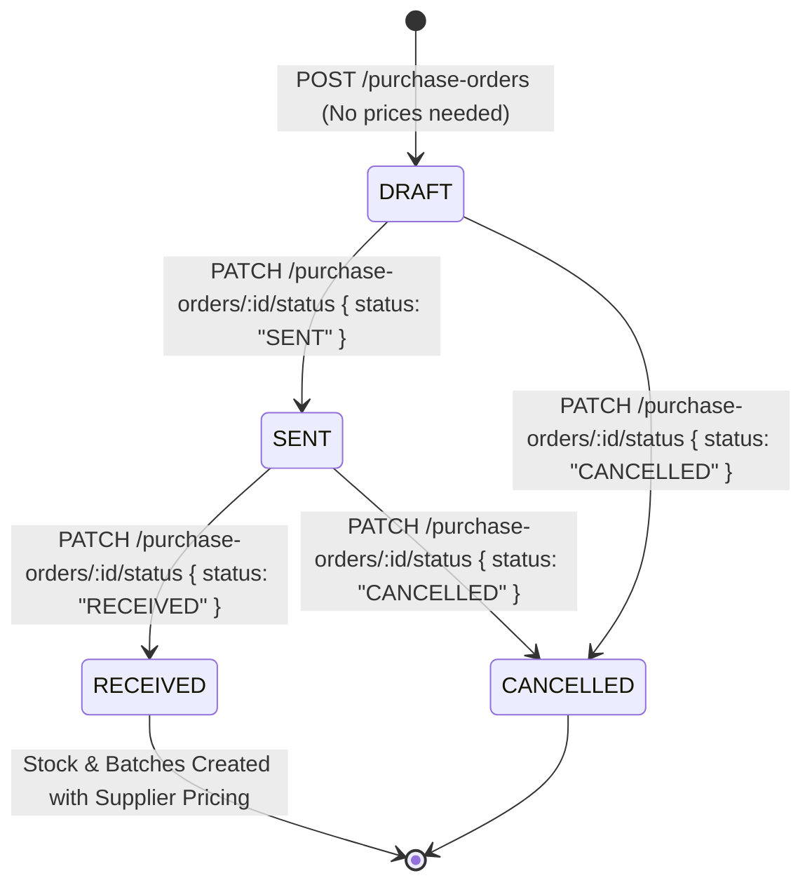

# 📦 Frontend Integration Guide: Purchase Orders Management

This guide details the integration endpoints available in the **Basta Kape API** for managing Purchase Orders (PO), ordering ingredients from suppliers, tracking status lifecycles, and auto-populating pricing upon delivery.

---

## 🔐 Access Control & Authorization

All endpoints require JWT authentication via `Authorization: Bearer <token>`.
Access is governed by Role-Based Access Control (RBAC) under the **Purchase Orders Management** module (`PURCHASE_ORDERS_MANAGEMENT`).

| Role              | Allowed Actions                             |
| :---------------- | :------------------------------------------ |
| **Administrator** | `create`, `read`, `update`, `delete`        |
| **Owner**         | `read` (executive dashboard & audit review) |

---

## 🔄 PO Lifecycle & Pricing Workflow



1. **Creating a PO (`DRAFT`)**:
    - The user selects a supplier and selects ingredients and quantities.
    - **`unitCost` is NOT required** when drafting a PO. Prices come directly from the supplier catalog (`SupplierIngredient`).
    - The initial `totalAmount` and item `unitCost`/`totalCost` will be `0`.

2. **Sending the PO (`SENT`)**:
    - Marking as `SENT` signifies that the order has been transmitted to the supplier.
    - Recorded with `orderedAt` timestamp.

3. **Receiving Delivery (`RECEIVED`)**:
    - When the supplier delivers the items, mark the PO as `RECEIVED`.
    - **Automatic Price Population**: The system automatically queries the supplier's catalog price (`SupplierIngredient.unitCost`) for each ingredient.
    - The system calculates `item.totalCost = quantity * supplierPrice` and updates `PurchaseOrder.totalAmount`.
    - The inventory batches (`IngredientBatch`) and stock transactions are automatically created using the populated supplier pricing.
    - **Optional Price Override**: If the invoice delivered has specific/adjusted prices, the receiving staff can pass custom item prices in the request body.

---

## 🌐 Endpoints

### 1️⃣ List Purchase Orders

- **Endpoint**: `GET /purchase-orders`
- **RBAC Action**: `read`
- **Query Parameters**:
    - `page` (number, default: `1`)
    - `limit` (number, default: `20`, max: `100`)
    - `search` (string, optional): Search by PO number (e.g. `"PO-2026"`)
    - `status` (enum: `"DRAFT" | "SENT" | "RECEIVED" | "CANCELLED"`, optional)
    - `supplierId` (UUID, optional)
    - `dateFrom` (ISO date string, optional)
    - `dateTo` (ISO date string, optional)
- **Response (200 OK)**:

```json
{
    "data": [
        {
            "id": "po-uuid-1",
            "poNumber": "PO-20260920-0001",
            "status": "DRAFT",
            "notes": "Weekly bean restock",
            "totalAmount": 0,
            "supplierId": "supplier-uuid-1",
            "supplier": {
                "id": "supplier-uuid-1",
                "name": "Kape Beans Trading Co."
            },
            "createdBy": {
                "id": "user-uuid-1",
                "username": "adminUser",
                "firstName": "System",
                "lastName": "Manager"
            },
            "_count": { "items": 2 },
            "orderedAt": null,
            "receivedAt": null,
            "createdAt": "2026-09-20T12:00:00.000Z",
            "updatedAt": "2026-09-20T12:00:00.000Z"
        }
    ],
    "meta": {
        "total": 1,
        "page": 1,
        "limit": 20,
        "pageCount": 1,
        "hasMore": false
    }
}
```

---

### 2️⃣ Get Purchase Order Details

- **Endpoint**: `GET /purchase-orders/:id`
- **RBAC Action**: `read`
- **Response (200 OK)**:

```json
{
  "id": "po-uuid-1",
  "poNumber": "PO-20260920-0001",
  "status": "RECEIVED",
  "notes": "Weekly bean restock",
  "totalAmount": 3150.00,
  "supplierId": "supplier-uuid-1",
  "supplier": {
    "id": "supplier-uuid-1",
    "name": "Kape Beans Trading Co."
  },
  "items": [
    {
      "id": "item-uuid-1",
      "ingredientId": "ingredient-uuid-1",
      "quantity": 20,
      "unitCost": 157.50,
      "totalCost": 3150.00,
      "ingredient": {
        "id": "ingredient-uuid-1",
        "name": "Arabica Beans - Dark Roast",
        "defaultUnit": {
          "id": "unit-uuid-1",
          "name": "Kilograms",
          "abbreviation": "kg"
        }
      }
    }
  ],
  "batches": [ ... ],
  "orderedAt": "2026-09-20T12:15:00.000Z",
  "receivedAt": "2026-09-20T14:30:00.000Z"
}
```

---

### 3️⃣ Create Purchase Order (Draft)

- **Endpoint**: `POST /purchase-orders`
- **RBAC Action**: `create`
- **Note**: `unitCost` is **NOT** required.
- **Request Body**:

```json
{
    "supplierId": "supplier-uuid-1",
    "notes": "Emergency milk & syrup delivery",
    "items": [
        {
            "ingredientId": "ingredient-uuid-milk",
            "quantity": 30
        },
        {
            "ingredientId": "ingredient-uuid-vanilla",
            "quantity": 5
        }
    ]
}
```

- **Response (201 Created)**: Returns created PO with status `"DRAFT"` and `totalAmount: 0`.

---

### 4️⃣ Update Draft Purchase Order

- **Endpoint**: `PUT /purchase-orders/:id`
- **RBAC Action**: `update`
- **Note**: Only POs in `DRAFT` status can be edited.
- **Request Body**:

```json
{
    "notes": "Updated note",
    "items": [
        {
            "ingredientId": "ingredient-uuid-milk",
            "quantity": 35
        }
    ]
}
```

---

### 5️⃣ Update PO Status & Receive Delivery

- **Endpoint**: `PATCH /purchase-orders/:id/status`
- **RBAC Action**: `update`

#### Transitioning to `SENT`:

```json
{
    "status": "SENT"
}
```

#### Transitioning to `RECEIVED` (Auto-populates prices from Supplier):

```json
{
    "status": "RECEIVED"
}
```

> The system automatically looks up each item's price in `SupplierIngredient` for the PO's supplier, updates each item's `unitCost` and `totalCost`, updates the PO `totalAmount`, and stocks the batches into inventory.

#### Transitioning to `RECEIVED` with Custom/Adjusted Invoice Prices (Optional):

```json
{
    "status": "RECEIVED",
    "items": [
        {
            "ingredientId": "ingredient-uuid-milk",
            "unitCost": 95.0
        }
    ]
}
```

> If provided, the passed `unitCost` will be used instead of the supplier catalog price.
